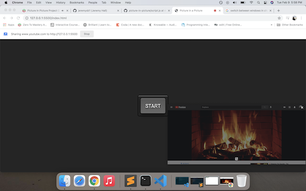

# Picture in a Picture Vanilla JS Project

I created a picture in a picture (like a video) with the the Picture-in-Picture Web API and screen capture API. 

I read the picture in a picture API [documentation](https://w3c.github.io/picture-in-picture/) and screen capture API [documentation](https://developer.mozilla.org/en-US/docs/Web/API), and learrned how to create the project.

## What this final project looks like

As an example, I selected a youtube video of a fire burning in the fireplace to play in the background.

As a user, I can resize the video playing in the background or move it on the screen. 

